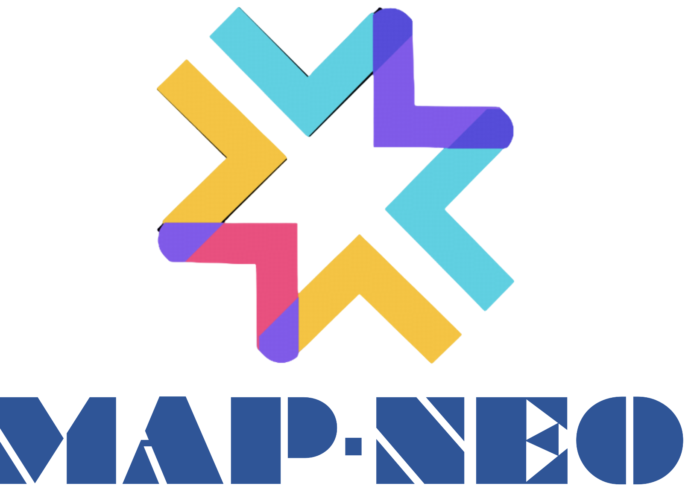
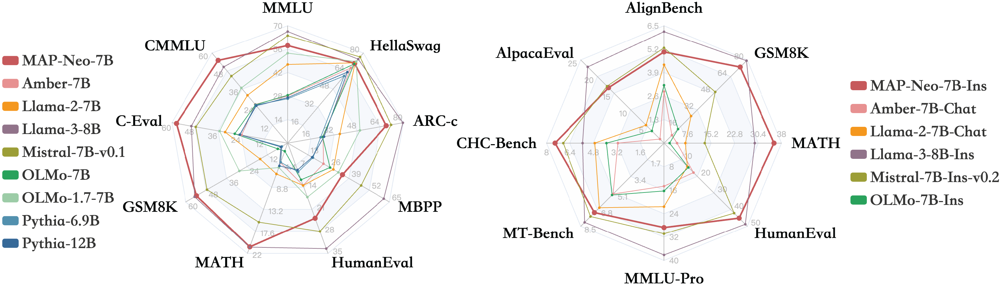

# MAP-NEO: A fully open-sourced Large Language Model
<div align="center">
    <p>
    <b>MAP-NEO</b> is a <b>fully open-sourced</b> Large Language Model that includes the pretraining data, a data processing pipeline (<b>Matrix</b>), pretraining scripts, and alignment code. It is trained from scratch on 4.5T English and Chinese tokens, exhibiting performance comparable to LLaMA2 7B. The MAP-Neo model delivers proprietary-model-like performance in challenging tasks such as reasoning, mathematics, and coding, outperforming its peers of similar size. For research purposes, we aim to achieve full transparency in the LLM training process. To this end, we have made a comprehensive release of MAP-Neo, including the final and intermediate checkpoints, a self-trained tokenizer, the pre-training corpus, and an efficient, stable optimized pre-training codebase. 
    </p>
    <p>
    
    </p>
    <p>
    </p>
 <div align="center">

 

  <a href="https://map-neo.github.io/"></a>

  <a href="https://huggingface.co/collections/m-a-p/neo-models-66395a5c9662bb58d5d70f04" target="_blank">
    
  </a>
  <a href="https://arxiv.org/abs/2405.19327" target="_blank">
    
  </a>

</div>
  <a href="https://discord.com/invite/qeRsjRdRHf" target="_blank">
    
  </a>
  <a href="figure/Wechat_QR.jpg" target="_blank">
    
  </a>
  <a href="https://twitter.com/GeZhang86038849/status/1788874345927889203" target="_blank">
    
  </a>
    <a href="https://github.com/multimodal-art-projection/MAP-NEO"></a>
</div>


## Evaluation Results
### MAP-NEO 7B Series

We evaluated the MAP-Neo 7B Series and other similarly sized models on various benchmarks, as shown in the following.

<p align="center">

</p>

For more details on the performance across different benchmarks, please refer to https://map-neo.github.io/.

## Model & DATA Downloads

We are pleased to announce the public release of the MAP-NEO 7B, including base models and a serious of intermedia checkpoints. This release aims to support a broader and more diverse range of research within academic and commercial communities. Please **note** that the use of this model is subject to the terms outlined in [License section](#license). Commercial usage is permitted under these terms.  

### Huggingface

|         Model & Dataset         |                                 Download                                 |
|:---------------------:|:-----------------------------------------------------------------------:|
| MAP-NEO 7B Base       | 🤗 [HuggingFace](https://huggingface.co/m-a-p/neo_7b)  |
| MAP-NEO 7B Instruct       | 🤗 [HuggingFace](https://huggingface.co/m-a-p/neo_7b_instruct_v0.1)  |
| MAP-NEO 7B SFT       | 🤗 [HuggingFace](https://huggingface.co/m-a-p/neo_7b_sft_v0.1)  |
| MAP-NEO 7B intermedia       | 🤗 [HuggingFace](https://huggingface.co/m-a-p/neo_7b_intermediate)  |
| MAP-NEO 7B decay       | 🤗 [HuggingFace](https://huggingface.co/m-a-p/neo_7b_decay)  |
| MAP-NEO 2B Base       | 🤗 [HuggingFace](https://huggingface.co/m-a-p/neo_2b_general)  |
| MAP-NEO scalinglaw 980M       | 🤗 [HuggingFace](https://huggingface.co/m-a-p/neo_scalinglaw_980M)  |
| MAP-NEO scalinglaw 460M       | 🤗 [HuggingFace](https://huggingface.co/m-a-p/neo_scalinglaw_460M)  |
| MAP-NEO scalinglaw 250M       | 🤗 [HuggingFace](https://huggingface.co/m-a-p/neo_scalinglaw_250M)  |
| MAP-NEO DATA Matrix   | 🤗 [HuggingFace](https://huggingface.co/datasets/m-a-p/Matrix)  |
## License
This code repository is licensed under the MIT License. 

## Citation
```
@article{zhang2024mapneo,
    title   = {MAP-Neo: Highly Capable and Transparent Bilingual Large Language Model Series},
    author  = {Ge Zhang and Scott Qu and Jiaheng Liu and Chenchen Zhang and Chenghua Lin and Chou Leuang Yu and Danny Pan and Esther Cheng and Jie Liu and Qunshu Lin and Raven Yuan and Tuney Zheng and Wei Pang and Xinrun Du and Yiming Liang and Yinghao Ma and Yizhi Li and Ziyang Ma and Bill Lin and Emmanouil Benetos and Huan Yang and Junting Zhou and Kaijing Ma and Minghao Liu and Morry Niu and Noah Wang and Quehry Que and Ruibo Liu and Sine Liu and Shawn Guo and Soren Gao and Wangchunshu Zhou and Xinyue Zhang and Yizhi Zhou and Yubo Wang and Yuelin Bai and Yuhan Zhang and Yuxiang Zhang and Zenith Wang and Zhenzhu Yang and Zijian Zhao and Jiajun Zhang and Wanli Ouyang and Wenhao Huang and Wenhu Chen},
    year    = {2024},
    journal = {arXiv preprint arXiv: 2405.19327}
}
```

## Contact


For further communications, please scan the following WeChat and Discord QR code:

<table>
  <tr>
    <td>WeChat </td>
    <td>Discord </td>
  </tr>
  <tr>
    <td></td>
    <td></td>
  </tr>
</table>
